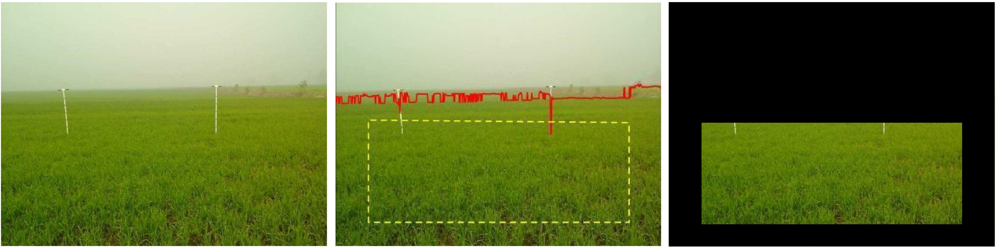
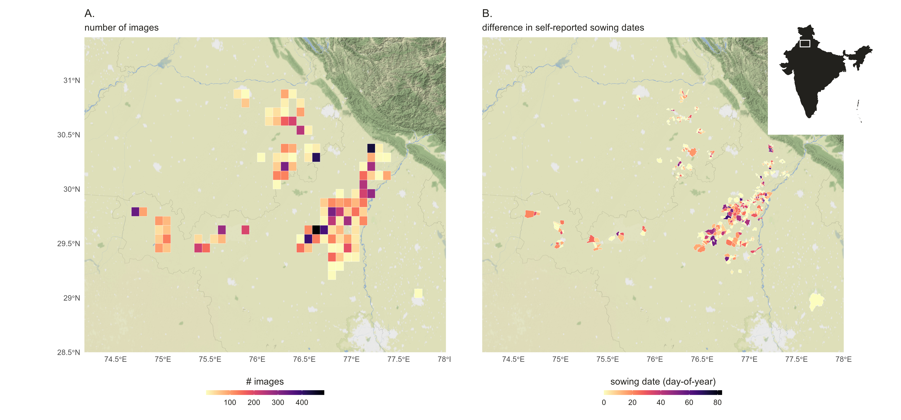
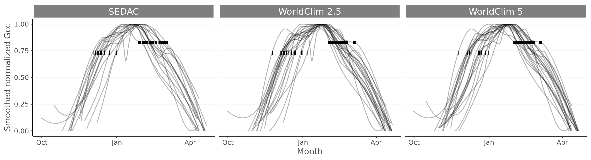
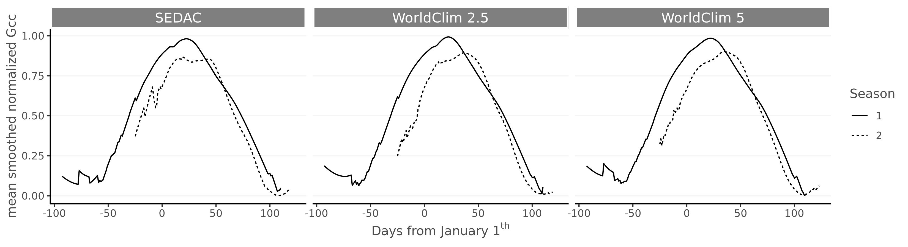

```{r setup, include=FALSE, message=FALSE}
  knitr::opts_chunk$set(echo = TRUE)
  library(tidyverse)
  library(ggplot2)
  library(ggthemes)
  library(knitr)
  library(xtable)
  
  zadoks <- as.data.frame(read.table("tables/ripening_scale.csv",
                       header = TRUE,
                       sep = ","))
  
  colnames(zadoks) <- c("Rabi 2016 - 2017",
                        "Rabi 2017 - 2018",
                        "Zadoks",
                        "Non Zadoks (out of range)")
```

\introduction[Introduction]

Smallholder agriculture supports livelihoods of 2.5 billion people globally, contributing 30-50% of global food supply and 80% of the food produced in Sub-Saharan Africa and Asia [@ifad2013; @lowder2016]. Although smallholder agriculture underpins food security, the scale at which smallholder farmers operate make them highly vulnerable to production risks resulting from localized extreme weather events. 

Agricultural advisory services and crop insurance can help farmers manage these risks, but the quality of these services will crucially depend on the ability to monitor extreme weather events and their impacts on crop development. In that regard, it is important to note that the impact the impact of extreme weather events is not distributed equally. Differences in socio-economic background and the highly localized nature of some extreme weather events (e.g. heavy rainfall, hailstorms) can result in heterogeneous crop losses even within small geographic areas [@below2012; @fishman2016; @ifad2013; @jain2015]. Extreme weather events are likely to be exacerbate through climate change, both in terms of their frequency and magnitude, across both tropical and sub-tropical regions where most smallholder farmers are concentrated [@auffhammer2012; @harvey2014; @morton2007]. This highlights the urgent need for solutions to improve producers’ resilience to weather-related production risks throughout the growing season.

For example, heat stress has damaging impacts on yields especially during crop flowering, or anthesis [@lobell2011]. Temperatures above 30$^\circ$C during wheat anthesis cause complete sterility [@farooq2011; @saini1982]. Lodging of wheat through the toppling of stems is known to be heavily influenced by occurrence of heavy rain and/or high wind only in later stages of wheat development [@berry2003; @gent1997; @vera2012]. Both examples highlight the importance of monitoring crop development (or phenology) at an appropriate scale across time. Measurements of crop phenology are therefore critical inputs to support monitoring of agricultural productivity in smallholder systems and provide targeted interventions [@auffhammer2012; @carletto2015; @harvey2014; @morton2007].

To date, efforts to monitor and map weather impacts on production have been limited by a lack of systematic field-level crop (yield) data collection and reporting (e.g. via farmer surveys) in most developing countries. Similarly, while advances have been made in the use of remote sensing imagery to map crop yields at field-scales [@azzari2017; @burke2017; @jain2015], there remain significant challenges to the application of satellite-based methods for reliable crop yield assessment in smallholder systems due to the mismatch between the spatial resolution of openly-accessible satellite imagery, small plot sizes, highly heterogeneous cropping patterns, and high levels of cloud cover during crop growth seasons [@duncan2015; @jain2017; @mann2017; @hufkens2019]. However, there is a potential to use near-surface imagery, i.e. conventional digital images taken near ground level, to support phenological monitoring and rapid assessments of field-level impacts of extreme weather events on smallholder agricultural productivity [@hufkens2019; @ceballos2019]. Previous research has shown that near-surface imagery of crop [@hufkens2019] and vegetation [@hufkens2012] development has the ability to capture growth phases at a scale which is not attainable using medium to high resolution satellite remote sensing data. More so, the visual nature of the data allows for intuitive post-hoc assessments of crop damage and growth stages in support of classical statistical and machine learning based analysis.

Here, we describe a curated dataset of georeferenced and time-stamped smartphone images of insured wheat fields originally collected to support insurance claims verification, or Picture Based Insurance (PBI) [@ceballos2017], across two winter growing seasons (Rabi) in India’s Punjab and Haryana states. Given the strong dependence of crop yields on intra-seasonal weather variability and management practices, these data and their derived data products could enable significant improvements in field-level crop growth status and yield loss estimation in agricultural systems, as well as remote sensing product validation.

# Study location

The study summarized data from two separate field trials across two Rabi, across India’s Punjab (Fatehgarh, Ludhiana, Patiala districts) and Haryana (Fatehabad, Sirsa, Yamunanagar districts). These states are part of the Indo-Gangetic Plains, a zone of importance for crop production, which accounts for around 30% of India’s total wheat production. 

The climate across both states is mostly dominated by a hot arid steppe climate, according to the Koeppen-Geigen scale. The southern part of both states are characterized by warm temperate conditions with dry winters and hot summers, while the north has an arid hot desert climate. Most of the villages in our field trials were located in a hot arid steppe climate. Smallholder agriculture in this area is largely mechanized and is heavily reliant on irrigation [@kumar2018]. Punjab and Haryana fields are typically double-cropped with rice (or cotton) planted during the Kharif monsoon (June - October), and wheat planted in the Rabi season (October - March). Across all sites, mean annual temperatures and precipitation are 24.45 $\pm$ 0.2$^\circ$C and 725 $\pm$ 215 mm, respectively [@Hijmans2005] while precipitation between sites varies from 315 to 1407 mm.

The PBI initiative selected study sites following a clustered sampling approach. A 150 villages were randomly chosen within a radius of 5km from third-party weather stations in the area. During the first Rabi 50 villages were included in the study, while we increased sampling during second Rabi adding and additional 100 villages. Within each village, 15 farmers satisfying a number of criteria were randomly selected to be invited for study participation. The criteria required [@ceballos2019] that the smallholder farmer (1) had less than 15 acres of operational land; (2) was in possession of an android smartphone; and (3) was planning to grow wheat during the upcoming growing season (running from November - April). Over two growing seasons a total of 1685 farmers (or 4 $\pm$ 4 farmers per village) agreed to participate in the PBI studies. For these farmers, the study team listed all plots on which the farmer was planning to grow wheat, and randomly selected one field for each farmer to be included in the study. Image acquisition in the first-year villages was coordinated by the Borlaug Institute for South Asia and the new second-year villages in Haryana were suppervised by the Centre for Agriculture and Bioscience International (CABI) and its subcontractor Kisan Sanchar.

# Data acquisition & Screening

During the first field season farmers were asked to take 1 – 3 repeat pictures per week throughout the season, between 10:00h and 14:00h local time from approximately the same location as an initial northward oriented picture, and with approximately the same viewing angle. During the second field season data acquisitions were lowered to a suggested image every 4 days. The outlined protocol adheres as closely as possible to the PhenoCam guidelines established by @Sonnentag2012, while taking into consideration the constraints imposed by the use of a smartphone and the farmer’s time availability. Image acquisitions were facilitated using a custom Android application (WheatCam).

The farmer set up an observation site by taking an initial geo-referenced image of a field. Subsequent images were referenced relative to the initial “ghosted” image (a mildly transparent image of the initial picture) and the location shown on an interactive map.

The application allowed the farmer to frame nearly identical repeat pictures relative to landscape features (or one or two installed reference poles, which were used only in the first year). A fixed white balance between images was used to minimize in-camera adjustment of illumination and RGB ratios. All pictures were uploaded to a server for further processing.

Before further processing we manually screened all images to ensure that no people were present in the image scenes, to guarantee their privacy. In addition, we removed images which were mistakenly taken indoors, or other accidental acquisitions. We further screened for images which were excessively blurred or discoloured, covered by a finger or otherwise not contained little vegetation or taken during crop cutting or application development.

We anonymized the dataset by masking most non-vegetation details which might provide clues to the exact position of a farmers' field, while selecting the vegetation of interest for processing (see below). In our dataset we provide all images anonymized sorted by farmer, as indicated by a sequential number (see data descriptor below).

```{r, out.width = "16cm", echo = FALSE, fig.cap = "Image as acquired by a smallholder farmer of a wheat field during the early growing season (left panel). The location of image acquisition location was constrained by the reference pole(s) in the image and the GPS location of the farmer's smartphone. The image was anonymized by automatically detecting the approximate horizon (center panel) to define a region of interest, which is retained while all other data is set to black (right panel), limiting identifiable landscape elements. Image adapted from [@hufkens2019]"}

```

# Preprocessing

## Region-of-Interest delineation & privacy measures

It has been shown that greenness indices calculated from digital repeat photography provides valuable information on the phenology of natural ecosystems and agricultural fields alike [@richardson2018; @hufkens2016; @hufkens2019]. However, most digital repeat photography uses fixed tower based cameras, making image processing relatively straightforward using a fixed Region-of-Interest (ROI) over which to calculate greenness metrics. The absence of a fixed vantage point made delineating a fixed ROI over which to calculate this color vegetation index impossible. We therefore automatically delineate a ROI on an image-by-image basis using a horizon detection algorithm. The algorithm first resizes the image to 640 pixels along the x-axis, scaling the y-axis proportionally. The algorithm finds change points in the blue channel along the vertical axis of the images using the Pruned Exact Linear Time (PELT) method [@killick2011], approximating the location of the horizon. We then define a trapezoid ROI defined by the median horizon locations for the left and right half of the image, padded by 15% of the image height and 10% of the image width along y and x-axis directions respectively. Similarly, the two bottom corner points were defined by padding the bottom and sides of the image by 10% of the image width and height. We use this ROI to exclude most other features from the original image which do not pertain to the area evaluated. Areas of no interest are set to black and the image is saved to disk. In addition, we manually screened all processed images and made manual corrections to guarantee the privacy of volunteer farmers where necessary.

## Vegetation indices

We calculated a number of vegetation indices for every images based upon band ratios of the red, green and blue channel image data (i.e digital numbers or DN). In particular, we calculated the 90^th^ percentile Green Chromatic Coordinates (Gcc, Eq. 1) across the ROI of every image to increase the stability of the greenness signal over time [@Sonnentag2012; @richardson2018]. Gcc is defined as the ratio of the green digital number and the sum of all digital numbers (or image brightness, see Eq. 1). 

Smartphone cameras are not radiometrically calibrated. Absolute Gcc values are therefore affected by differences in image rendering between devices, making the absolute values incomparable across sites. As such, Gcc values were composed into time series smoothed and normalized between 0 and 1 using a fitted locally estimated scatterplot smoothing (loess) model with a fixed span of 0.4. Normalization between 0 and 1 accounts for these differences in image rendering and allows us to create data that is meaningfully comparable. Smoothing of the Gcc time series removes occasional outliers but retains the overall trajectory, when sufficient data points are available. Due to uneven time steps in image acquisition we use daily interpolated smoothed data in all subsequent analyses and data products. If insufficient data is available, the smoothing routine will effectively be a linear interpolation between data points. Both the original values and the normalized smoothed data for acquisition dates are reported in our dataset.

```
  Gcc = Green DN / (Red DN + Green DN + Blue DN)			(Eq. 1)
```

We also report the 90^th^ percentile Red Chromatic Coordinate (Rcc, Eq. 2) and the 10^th^ percentile Green Red Vegetation Index (GRVI, Eq. 3, @motohka2010) and the individual DN of the three (RGB) colour channels. These data allow for further analysis of the colour information in the images without the reprocessing of the image data.

```
  Rcc = Red DN / (Red DN + Green DN + Blue DN)			(Eq. 2)
  GRVI = (Green DN - Red DN) / (Red DN + Green DN)			(Eq. 3)
```

## Ancillary data

Before and during the image acquisition farmers were asked to complete a survey on crop varieties used, management practices applied and damages sustained. We report the variety of wheat planted, the presence of irrigation, the application of fertilizer, pesticides or herbicides since the last image taken. Statistics are provided on an image by image basis. Synoptic overviews of these data are provided in the spatially aggregated summary products (see below). 

Both field trials had different survey inputs concerning wheat development assessments. For consistency, we aggregated these into the common Zadoks scale of wheat growth stages [@zadoks1974] using a reclassification key or ontogeny (Table 1). We assigned values 0 and 10 to land preparation and post harvest phases, respectively, which did not fit the standard wheat development scale.

Note that wheat development phases during the first growing season were assessed by agronomists. In contrast, wheat development phases of the second growing season were self-reported, introducing considerable uncertainty. Discrepancies exist due to misinterpretation of these growth phases by the farmers.

```{r results='asis', echo = FALSE}
options(xtable.caption.placement = 'top',
        xtable.include.rownames = FALSE,
        xtable.comment = FALSE,
        xtable.booktabs = FALSE)

xtable(zadoks,
      caption = "Translation key for reclassification of manual labels across the two growing seasons (Rabi) into the Zadoks scale of wheat development.")
```

# Post-processing & derivative data products

## Data product structure

Our final data products consists of four main parts (1) the anonymized image data, (2) a master file of data derived from the individual images combined with matching ancillary data, (3) a summary dataset providing an overview of the data by regional aggregation derived, and finally, (4) a data file containing smoothed time series by regional aggregation. The latter two products are derived from the master file and are provided for convenience in a format to reach a broad audience while limiting the processing by the end user.

To limit the number of files, at the expense of file size, we include all field based quality control summary data into the master data file. Summary statistics based upon the aggregated spatial units were used to anonymize the data. These summaries provide insights into regionally averaged trends and include for example the number of farmers who reported irrigation or other management practices for a given town or WorldClim grid cells. These two formats are provided as aggregated levels will appeal to different research diciplines. We used two aggregation approaches as administrative boundaries are more meaningful in socio-economic analysis and gridded data are more relevant within the context of remote sensing validation and crop modelling.

To support easy processing in both R or using the python (pandas) environments we structured all data according to tidy data principles [@wickham2014], or row first (long format) orientation. Detailed lists of variables and the data structures are provided in the Appendix tables 1 to 3, while a full description of the post-processing and summary statistics routines is provided below.

## Geospatial anonymization 

The data were anonymized by aggregating the exact field locations to larger spatial units. These spatial units ensures a suitable level of obfuscation to provide the volunteer smallholder farmers with the required privacy. In order to accommodate several use cases all data locations (coordinates) are anonymized using either administrative boundaries or common grid cell spacing used in climate products. The final (master) dataset, as such, does not contain any geo-location data of individual farmers, to maintain their privacy, while retaining some spatial information to support subsequent spatial analysis. We used the publicly available India Village-Level Geospatial Socio-Economic Data Set (SEDAC, accessed January 2020) to re-assign field locations to the centroid of the village polygon. Similarly, we used the WorldClim [@Hijmans2005] grid cell layout to provide grid cell locations at both a 2.5 and 5 minute grid levels. Combined with the removal of most recognizable features in the raw image data (see above) these spatial untis ensure the privacy of the volunteers.

## Quality control

We provide several ways to screen data for quality in acquisition frequency and timing. We include the number of images for each field, the duration of the acquisitions (in days), the mean spread between individual image acquisitions and a derived quality assurance (QA) index.
The QA index is defined as the ratio between the total image count and the spread. 

```
  QA = Total number of acquired images / days between acquisitions (Eq. 4)
```

The lower the QA index, the lower the quality of the resulting time series of images. The QA index, and other quality control data allows for the screening of the data at both the field level and the level of the spatial unit. These quality indicators are propagated from a field level to spatial units level through averaging.

## Crop phenophases & phenology time series

We report crop phenology statistics as phenological phases (phenophases) for all spatial locations and all spatial units (i.e. SEDAC village level and both WorldClim grid cell sizes). Fixed threshold values were applied to quantify the end of the wheat tillering phase and the start of ripening, at 73% and 83% of the rising and falling part of the seasonal Gcc curve respectively. These thresholds have previously been linked to distinct developmental phases of wheat [@hufkens2019]. Both wheat phenophases, tillering and the start of ripening, approximate Zadoks scale levels 2 and 5.

We pooled all raw Gcc data across a spatial unit. Doing so we leveraged all available image data, rather than averaging field based phenoloy estimates. Prior to calculating these thresholds the Gcc data is smoothed using a loess curve with a span value of 0.4 and normalized between 0 an 1. If insufficient data was available smoothing would result in simple linear interpolation between data points. All phenology metrics are reported as ISO dates (YYYY-MM-DD), with standard deviation in days. All dates are reported irrespective of the quality of the data on a field or aggregated level. We refer to the data QA index and provided code for further screening of the reported data or bespoke reprocessing. Finally, we report the smoothed normalized seasonal profiles of crop greenness (Gcc) for all spatial locations.

## Summary statistics

Although all raw data is reported in the master data file we provide a number of summary statistics based on common use cases. For spatial locations across spatial units we provide summary statistics for the number of fields and farmers for a given spatial location as well as the total number of fields where management practices were reported (weeding, tilling, sowing, damages by rain etc). We report the mean and standard deviation for those statistics which include measured values, such as the density of fertilizer or herbicide applied (kg / acre). In addition, quality assurance metrics are propagated and we report the mean QA index, spread, number of values, and duration for a given spatial location. We also provide the total number of values, and where available the mean and standard deviation on the self-reported sowing date. We acknowledge that we do not provide every possible summary statistic as derived from the master data file. However, by making all processing code available we hope to facilitate custom summary statistics from the master data file according to bespoke needs (see code availability).

# Results

We present a consistently processed dataset of near-surface remote sensing images acquired using inexpensive smartphones at 1697 smallholder farmers fields in northwest India (476 and 1221 for the first and second growing season, respectively). In the interest of brevity in reporting on the dataset we will limit summary statistics to either global statistics across the two growing seasons or regional ones for the SEDAC town based boundaries.

Across the two growing season, 1964 fields were monitored. A total of 20294 images were considered valid for processing. Data coverage across sites varies widely from a couple of images acquired throughout the entire growing season, to steady biweekly acquisitions. On average for every field across the two seasons, 17.8 $\pm$ 18.1 and 7.73 $\pm$ 10.6 images were recorded for the first and second growing season, respectively. The difference in numbers of images per field between the two seasons can be attributed to a more relaxed requirements during the second field season.

```{r, out.width = "100%", echo = FALSE, fig.cap = "Summary maps of some of the data. A. The number of farmers at a WordClim 5 degree grid size and B. the difference between first and last self-reported sowing date in a given village (SEDAC polygons). Topleft inset provides the location of the plotted area within India itself. Both aggregation levels are provided in the dataset."}

```

Although the ancillary data was voluntarily reported, and hence uptake of reporting might vary, some important trends could be noted. In general irrigation is a widespread practice in the region which is corroborated by the self-reported data, with 60 ($\pm$ 12) % of the fields being irrigated at some point during the growing season. Aggregating across various resolutions we see that throughout the region no obvious spatial patterns exist with respect to irrigation (Figure 2), suggesting widespread access to water sources and irrigation infrastructure [@kumar2018].

Similarly, it is shown that both the sowing dates self-reported during the second season or the timing of tillering across all growing seasons is widely variable across fields and regions. Evaluating the self-reported sowing dates we find a mean sowing date of the 11th of November, with a standard deviation of 14 days. These self-reported statistics are in line with previously assessed dates from the first season [@hufkens2019].

```{r, out.width = "100%", echo = FALSE, fig.cap = "Normalized and smoothed time series of vegetation greenness (Gcc) aggregated by spatial location and spatial unit. Only spatial locations with more than 150 image acquisitions are shown. Phenology transition dates at 73 and 83 percent threshold level of the curve are depicted by a plus and square marks, respectivelly."}

```

There are slight differences between the two growing seasons when comparing the phenology during the early season development (rising part of the Gcc curve). Here, the first season is on average a month early compared to the second growing season, reflecting differences in local crop management practices, with threshold dates reported at the 27th of December and the 24th of January respectively. Despite the difference in the timing of wheat growth between both growing season the variability within both datasets is similarly large up to 18.5 and 19.9 days, for the first and second season respectively. Using either the first image acquisition (a proxy for the sowing date) or the first sowing dates, for the first and second season respectively, we observe a difference of up to a month in the sowing of crops.


```{r, out.width = "100%", echo = FALSE, fig.cap = "Average normalized and smoothed time series of vegetation greenness (Gcc) by spatial unit for both growing seasons, showing the difference in average timing of crop development. Crop development is shown relative to the first of January of the growing season. Only spatial locations with more than 150 image acquisitions are shown."}

```

Looking at the variability across fields we see large differences in field management and subsequent crop development, which highlights the value of collecting plot-level images and associated farmer reports. In general there is large variability between fields. These differences have consequences which potentially propagate throughout the whole growing season, or could safeguard some farmers from crop damage while exposing others unduly. Our dataset shows that if sufficient data is available a clear seasonal trajectory and phenologically relevant transition dates can be extracted. Previous research has shown that these transition dates are linked to physiologically relevant growth phases, making them valuable inputs for model development or remote sensing validation [@hufkens2019]. Both the smoothed time series, and the extracted phenological transition dates are therefore key products derived from our image time series.

# Conclusion

We provide an anonymized dataset which characterizes the seasonal variability in crop development during two winter wheat growing seasons in Northern India, based upon ~20K near-surface remote sensing images. The data presented monitored both winter wheat growth by asking farmers to take pictures of their crops using their own smartphone cameras and extensive farmer reported meta-data on management practices, in addition to expert assessments on crop development and disturbances. In addition to raw data we highlight ways to process, anonymize and summarize the crowdsourced smartphone images, and provide derived data products to quantify crop greenness, phenology and regional data summaries. These data can provide valuable inputs to support crop modelling, validation of satellite remote sensing and machine learning in smallholder farming systems. In particular, data provide a mechanism to strengthen and advance spatially and temporally disaggregated crop development monitoring and yield estimation, contributing to efforts to design and target interventions to enable farmers to adapt and mitigate production risks resulting from climate variability and change.


